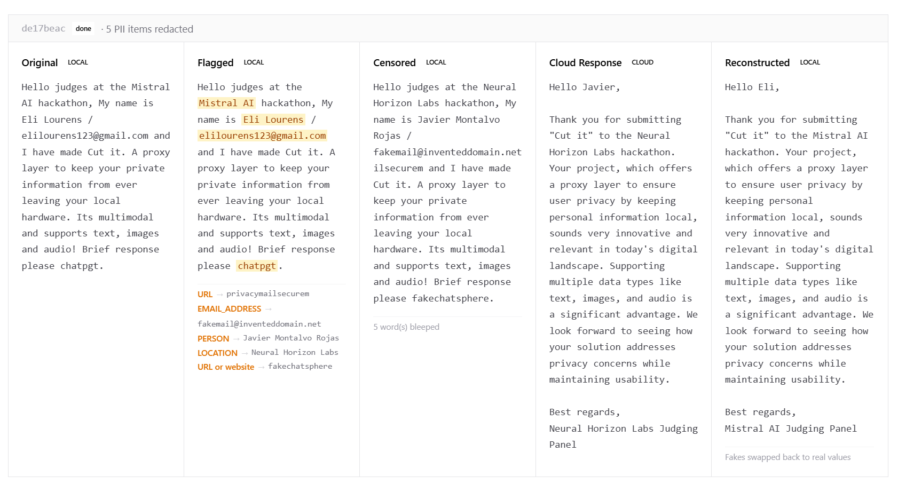

# Cut It

https://cutit.lovable.app/

A local privacy proxy that sits between your AI client and any cloud AI API. Before each request leaves your machine, it detects PII, replaces it with realistic fakes, and forwards only the sanitized version. When the response comes back, the real values are restored, so your application sees the original data while the cloud model never does.

A real-time dashboard shows every step of the pipeline as it happens.

---

## How it works

```
Your client  ->  localhost:8080/v1/...
             ->  [local screening]
             ->  real values swapped for coherent fakes
             ->  cloud provider API
             ->  response received
             ->  fakes swapped back for real values
             ->  your client
```

Every stage is broadcast over WebSocket to the dashboard. Screening runs entirely on your machine, nothing sensitive is sent upstream.

### Text

Incoming messages go through two passes before leaving the machine.

The first pass uses Presidio, a pattern-based engine that finds PII by exact span: names, email addresses, phone numbers, credit card numbers, SSNs, IBANs, IP addresses, and more. It is fast and precise.

The second pass sends the text to a local Ollama model, which reads it in context and catches anything the pattern engine missed, such as a name written in an unusual way or a reference that only makes sense in context.

Any value that is flagged gets replaced with a coherent fake generated by Ollama. For example, a real name becomes a different plausible name rather than a placeholder like `[REDACTED]`. The mapping between the fake and the real value is stored in a per-session vault. When the cloud model responds, the fakes are looked up in the vault and swapped back for the originals before the response reaches your client.



Think the censorship is too aggressive? It is completely configurable with 10+ different categories of things to censor which are toggleable from the dashboard.

### Images

When a message includes an image, it is passed to a local vision model that identifies regions containing sensitive content. Those regions are blacked out using Pillow. EasyOCR then extracts any text from the image and runs it through the same two-pass text screening pipeline described above. If any of that text contains PII, the corresponding area is also blacked out. Only the redacted image is forwarded to the cloud.

### Audio

When audio is captured from the microphone, Whisper transcribes it locally with word-level timestamps. The transcript is then run through the same text screening pipeline as above. Any word identified as PII is replaced in the audio with a 1 kHz bleep tone covering that exact time range. Only the bleeped audio leaves the machine.


## Detected PII types

Completely configurable. You can choose which types get screened and which do not.

Names, email addresses, phone numbers, physical locations and addresses, credit card numbers, IBAN and bank account numbers, IP addresses, US Social Security Numbers, US passport numbers, dates and times, nationality, religion and political affiliation, URLs, medical license numbers, organization names.

---

## Requirements

- Python 3.11+ with [Poetry](https://python-poetry.org/)
- Node.js 18+
- [Ollama](https://ollama.com/) running locally with a chat model pulled (e.g. `ministral` or any instruction-following model)

---

## Setup

**Backend**

```bash
cd backend
poetry install
poetry run python -m spacy download en_core_web_lg
```

**Frontend**

```bash
cd frontend
npm install
```

---

## Configuration

Create `backend/.env`:

```env
# Add keys for the providers you use
MISTRAL_API_KEY=...
MISTRAL_BASE_URL=https://api.mistral.ai
OPENAI_API_KEY=...
ANTHROPIC_API_KEY=...
GEMINI_API_KEY=...
GROQ_API_KEY=...
XAI_API_KEY=...

# Local Ollama
OLLAMA_BASE_URL=http://localhost:11434
OLLAMA_MODEL=ministral
WHISPER_MODEL=base
```

---

## Running

**Backend** (proxy on port 8080):

```bash
cd backend
poetry run uvicorn app.main:app --host 0.0.0.0 --port 8080 --reload
```

**Frontend** (dashboard on port 3000):

```bash
cd frontend
npm run dev
```

Point your AI client at `http://localhost:8080` instead of the provider's API URL. No other changes to your client are needed.

---

## Dashboard

Open [http://localhost:3000](http://localhost:3000) to see the live pipeline view. For each request it shows:

- The original message (before screening)
- The screened message (with fakes substituted)
- What was found and vaulted
- The cloud provider's response
- The final reconstructed response (real values restored)
